<!-- ╔══════════════════════════════════════════════════════════════╗ -->
<!-- ║   LORD — terminal-themed profile · palette: #0D1117 #58A6FF   ║ -->
<!-- ║   header: assets/header.svg (custom animated SVG)             ║ -->
<!-- ╚══════════════════════════════════════════════════════════════╝ -->

<div align="center">
  
</div>

<p align="center">
  <a href="https://github.com/MTaylanOzturk">
    
  </a>
</p>

<div align="center">
  
  
  
</div>

<br/>

<!-- ╔══════════════════════════════════════════════════════════════╗ -->
<!-- ║                        $ whoami                              ║ -->
<!-- ╚══════════════════════════════════════════════════════════════╝ -->

## ⚡ `$ whoami`

```text
lord@aesirmc:~$ neofetch

██╗      ██████╗ ██████╗ ██████╗    lord@aesirmc
██║     ██╔═══██╗██╔══██╗██╔══██╗   ─────────────────────────────
██║     ██║   ██║██████╔╝██║  ██║   OS:        Backend Developer (Java-powered)
██║     ██║   ██║██╔══██╗██║  ██║   Host:      AesirMC Network
███████╗╚██████╔╝██║  ██║██████╔╝   Kernel:    Java 21 · SQL · NoSQL
╚══════╝ ╚═════╝ ╚═╝  ╚═╝╚═════╝    Uptime:    coding since age 15
                                    Shell:     bash · docker · git
● ● ● ● ● ● ● ●                     Education: Software Engineering @ Aksaray University
                                    Location:  Türkiye 🇹🇷
                                    Focus:     turning raw data into business value
```

> I turned a passion that started at **15** into a professional career. Today I build backend systems in the **Java ecosystem** at **AesirMC** — a live game server network — while pursuing my **Software Engineering** degree at **Aksaray University**.
>
> Solid, battle-tested experience with **SQL**, **Docker**, **MongoDB** and **server-based architectures**. Disciplined, hardworking, and fast to adapt to any technological landscape.

<br/>

<!-- ╔══════════════════════════════════════════════════════════════╗ -->
<!-- ║                     $ ls ~/tech-stack                        ║ -->
<!-- ╚══════════════════════════════════════════════════════════════╝ -->

## 🛠️ `$ ls ~/tech-stack`

<div align="center">

`── languages ──`


`── data layer ──`


`── devops & tools ──`


`── game server ecosystem ──`


</div>

<br/>

<!-- ╔══════════════════════════════════════════════════════════════╗ -->
<!-- ║                     $ git log --stat                         ║ -->
<!-- ╚══════════════════════════════════════════════════════════════╝ -->

## 📊 `$ git log --stat`

<div align="center">

<a href="https://github.com/MTaylanOzturk">
  
  
</a>

<br/><br/>


<br/><br/>


<br/><br/>


</div>

<br/>

<!-- ╔══════════════════════════════════════════════════════════════╗ -->
<!-- ║          $ crontab -l  →  contribution snake                 ║ -->
<!-- ╚══════════════════════════════════════════════════════════════╝ -->

## 🐍 `$ crontab -l` — <sub>`0 0 * * *  regenerate contribution snake`</sub>

<div align="center">
  <picture>
    <source media="(prefers-color-scheme: dark)" srcset="https://raw.githubusercontent.com/MTaylanOzturk/MTaylanOzturk/output/snake-dark.svg" />
    <source media="(prefers-color-scheme: light)" srcset="https://raw.githubusercontent.com/MTaylanOzturk/MTaylanOzturk/output/snake.svg" />
    
  </picture>
</div>

<br/>

<!-- ╔══════════════════════════════════════════════════════════════╗ -->
<!-- ║                 $ tail -f /var/log/lord.log                  ║ -->
<!-- ╚══════════════════════════════════════════════════════════════╝ -->

## 📡 `$ tail -f /var/log/lord.log`

```log
[INFO ] core      ─ shipping backend systems @ AesirMC
[INFO ] edu       ─ software engineering @ Aksaray University
[INFO ] learning  ─ distributed systems · performance tuning · server architecture
[WARN ] system    ─ coffee.level = CRITICAL — refilling...
[INFO ] status    ─ open to interesting backend problems
```

<br/>

<!-- ╔══════════════════════════════════════════════════════════════╗ -->
<!-- ║                   $ ls ~/projects (optional)                 ║ -->
<!-- ║   Öne çıkarmak istediğin repoların adını REPO_ADI yerine     ║ -->
<!-- ║   yazıp bu bloğun yorumunu kaldır.                           ║ -->
<!-- ╚══════════════════════════════════════════════════════════════╝ -->

<!--
## 📌 `$ ls ~/projects`

<div align="center">
  <a href="https://github.com/MTaylanOzturk/REPO_ADI">
    
  </a>
</div>

<br/>
-->

<!-- ╔══════════════════════════════════════════════════════════════╗ -->
<!-- ║                  $ nmap — open ports (contact)               ║ -->
<!-- ╚══════════════════════════════════════════════════════════════╝ -->

## 📫 `$ nmap lord --open`

```text
Starting Nmap ( https://nmap.org )
Host is up (0.0001s latency). All handshakes welcome.
```

<div align="center">

| PORT | STATE | SERVICE | TARGET |
|:---:|:---:|:---|:---|
| `587/tcp` | 🟢 open | `smtp` — Email | [ozturkmahmuttaylan@gmail.com](mailto:ozturkmahmuttaylan@gmail.com) |
| `443/tcp` | 🟢 open | `https` — LinkedIn | [Mahmut Taylan Öztürk](https://www.linkedin.com/in/mahmut-taylan-%C3%B6zt%C3%BCrk-bb9615262/) |
| `6667/tcp` | 🟢 open | `irc` — Discord | [`godback_`](https://discord.com/users/godback_) |
| `25565/tcp` | 🟢 open | `minecraft` — Server | AesirMC Network |

</div>

<br/>

<!-- ╔══════════════════════════════════════════════════════════════╗ -->
<!-- ║                        FOOTER                                ║ -->
<!-- ╚══════════════════════════════════════════════════════════════╝ -->

<div align="center">

### 🌑 *"No tree can grow to heaven unless its roots reach down to hell."*


</div>
